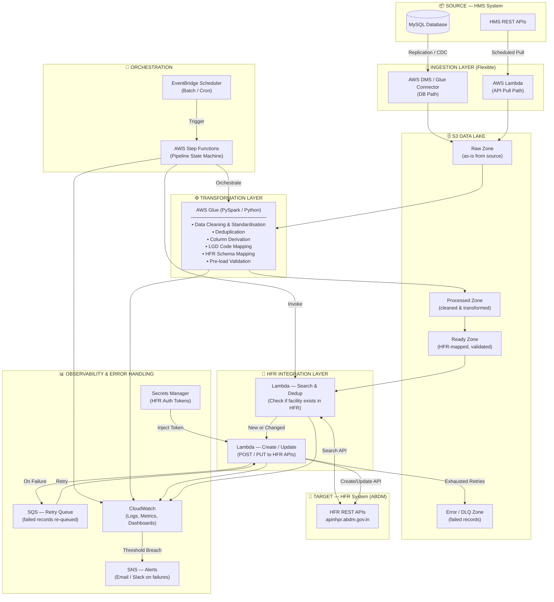

# HMS → HFR Integration Architecture
## High-Level Design Document

**Project**: HMS to Health Facility Registry (HFR) Data Integration Pipeline
**Platform**: AWS (Ground-up)
**Last Updated**: March 2026
**Status**: Initial Design / Pre-Development

---

## 1. Overview

The goal of this pipeline is to extract facility data from the **FundooHMS** (Hospital Management System), apply a series of data transformations, and push the structured, validated data to the **Ayushman Bharat Digital Mission (ABDM) Health Facility Registry (HFR)** via its REST APIs.

### Objectives
- Ingest facility data from HMS (via MySQL DB or HMS REST APIs)
- Clean, deduplicate, and derive required columns
- Map and validate data against the HFR API schema
- Push records to HFR — checking for existing facilities before creating new ones
- Handle failures gracefully with retry, logging, and alerting

---

## 2. High-Level Architecture Diagram

---

## 3. Architecture Layers

### 3.1 Source — HMS System
| Component | Details |
|---|---|
| **MySQL Database** | Direct DB access via replication or CDC (Change Data Capture) |
| **HMS REST APIs** | Pull via scheduled Lambda; covers scenarios where DB access is not available |

> **Note**: Both paths are designed to co-exist. The active path can be configured without changing downstream components.

---

### 3.2 Ingestion Layer
| Component | AWS Service | Purpose |
|---|---|---|
| **DB Path** | AWS DMS or Glue JDBC Connector | Replicate or snapshot HMS MySQL tables into S3 Raw Zone |
| **API Path** | AWS Lambda | Call HMS APIs on a schedule; write responses to S3 Raw Zone |

Both paths land data in the **S3 Raw Zone** in a common format (JSON/Parquet), ensuring the rest of the pipeline is source-agnostic.

---

### 3.3 S3 Data Lake (Storage Backbone)

The pipeline uses a **3-zone S3 Data Lake** pattern:

| Zone | S3 Prefix Example | Contents |
|---|---|---|
| **Raw Zone** | `s3://hms-hfr-pipeline/raw/` | As-is data from HMS — no transformations |
| **Processed Zone** | `s3://hms-hfr-pipeline/processed/` | Cleaned, deduplicated, derived columns |
| **Ready Zone** | `s3://hms-hfr-pipeline/ready/` | HFR-schema-mapped, validated, ready to push |
| **Error Zone** | `s3://hms-hfr-pipeline/errors/` | Records that failed after all retries |

> S3 as the backbone decouples every stage and enables **replay / reprocessing** from any point without re-extracting from the source.

---

### 3.4 Transformation Layer

**AWS Glue** (PySpark / Python Shell jobs) handles all ETL logic:

| Transformation | Description |
|---|---|
| **Data Cleaning** | Trim whitespace, normalise casing, fix encoding issues, remove nulls in mandatory fields |
| **Deduplication** | Identify and remove duplicate facility records within the HMS dataset |
| **Column Derivation** | Derive HFR-required fields (e.g., `ownershipCode`, `stateLGDCode`, `districtLGDCode`) from HMS data |
| **LGD Code Mapping** | Map facility location data to official Local Government Directory (LGD) codes |
| **HFR Schema Mapping** | Restructure and rename fields to match HFR API request payload format |
| **Pre-load Validation** | Validate mandatory fields, data types, accepted code values before push |

---

### 3.5 Orchestration

| Component | AWS Service | Role |
|---|---|---|
| **Scheduler** | Amazon EventBridge | Triggers the pipeline on a cron schedule (batch mode) or event-based trigger |
| **State Machine** | AWS Step Functions | Controls end-to-end pipeline flow, manages retries, branching, and error handling |

> Step Functions provides visibility into each pipeline run — which stage succeeded, which failed, and why.

---

### 3.6 HFR Integration Layer

Two Lambda functions handle the push to HFR:

| Lambda | HFR API Used | Logic |
|---|---|---|
| **Search & Dedup Check** | `GET /search` | For each record, search HFR by facility name + state + ownership. Determines if this is a **new create** or an **update**. |
| **Create / Update** | `POST /create` or `PUT /update` | Pushes the record to HFR. On HTTP failure, sends to SQS Retry Queue. |

> This two-step approach prevents duplicate facility registrations in HFR — a critical requirement per HFR documentation.

---

### 3.7 Error Handling & Observability

| Component | AWS Service | Purpose |
|---|---|---|
| **Retry Queue** | Amazon SQS | Failed push records are queued for retry with exponential backoff |
| **Error Zone** | S3 | Records that exhaust all retries are stored here for manual review |
| **Logging & Metrics** | Amazon CloudWatch | Centralised logs from all pipeline stages; custom metrics (records processed, failed, retried) |
| **Alerting** | Amazon SNS | Triggers email/Slack notifications on pipeline failure or error threshold breach |
| **Token Management** | AWS Secrets Manager | HFR auth tokens stored securely; auto-injected into Lambda at runtime |

---

## 4. Key Design Decisions

### Flexibility First
- **Dual ingestion paths** (DB + API) can both be active or individually toggled without impacting downstream stages
- **Batch and near-real-time** both supported — EventBridge handles batch scheduling; the same Step Functions state machine can be triggered by an event for real-time flows

### S3 as the Central Backbone
- Every stage reads from and writes to S3
- Enables full **data lineage** — raw source data is always preserved
- Supports **point-in-time reprocessing** — if transformation logic changes, re-run Glue from the Raw Zone without re-extracting from HMS

### Search Before Push
- The HFR Search API is called before every create to avoid duplicate facility registrations
- Only **new or changed** records proceed to the create/update step

### Retry Architecture
- SQS provides a durable, decoupled retry mechanism
- Failed records after exhausted retries land in the S3 Error Zone for manual intervention
- CloudWatch + SNS ensures the team is alerted before failures accumulate

---

## 5. Open Questions / Decisions Pending

| # | Question | Impact |
|---|---|---|
| 1 | Will HMS DB access be available, or only APIs? | Determines which ingestion path is primary |
| 2 | Batch schedule frequency (daily, hourly)? | Affects EventBridge cron and Glue job sizing |
| 3 | Will near-real-time be required? | May introduce Kinesis Data Streams into the ingestion path |
| 4 | LGD code mapping — is there a master reference available? | Required for the column derivation step in Glue |
| 5 | HFR sandbox access available for testing? | Required before building the HFR integration Lambda |
| 6 | Expected volume at steady state (10K facilities — one-time load or ongoing delta)? | Affects Glue job DPU sizing and Lambda concurrency limits |

---

## 6. Next Steps

1. **Confirm ingestion path** — DB direct vs API (or both)
2. **HFR field mapping exercise** — map every HMS field to its corresponding HFR API parameter
3. **LGD code reference data** — source the master LGD code dataset
4. **AWS account & VPC setup** — baseline infrastructure provisioning
5. **HFR sandbox onboarding** — get sandbox credentials for the ABDM test environment
6. **Detailed design** — break down each layer into component-level design

---

*Document prepared based on: FundooHMS Smart Hospital Management System documentation and ABDM Health Facility Registry API documentation (updated 16 March 2026).*
